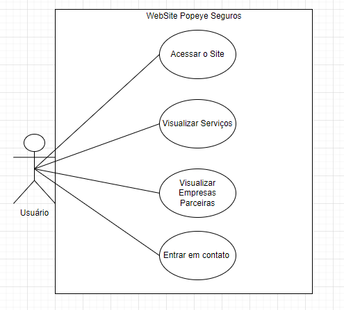

# WEBSITE POPEYE SEGUROS

**Desenvolvido por:** Victor Fonseca Bacchin

## 1. Stakeholders Envolvidos
- Gerente da empresa
- Usuários do sistema
- Desenvolvedor

## 2. Técnicas para Levantamento de Requisitos Utilizadas
- Entrevista
- Levantamento orientado a ponto de vista

## 3. Requisitos Funcionais
- Acesso ao site pela web
- Visualização dos serviços oferecidos pela corretora
- Visualização das empresas parceiras da corretora
- Oferecer contato da corretora para o usuário

## 4. Requisitos Não Funcionais
### Usuário:
- Design agradável e fácil de utilizar
- Disponível em vários dispositivos
- Resposta rápida

### Desenvolvedor:
- Documentação
- Portabilidade (capacidade de rodar em vários softwares ou hardware)
- Tecnologias atualizadas

## 5. Diagrama de Caso de Uso

## 6. Tecnologias Utilizadas
- HTML5
- CSS3
- Bootstrap
- JavaScript

## 7. Desenvolvimento
O projeto começou com a **identificação dos stakeholders**, que inclui o gerente da empresa e os usuários finais. Em seguida, foi realizada uma **entrevista** com o gerente e um levantamento orientado a ponto de vista, tanto com o desenvolvedor quanto com o gerente, para entender as necessidades específicas de cada parte.

O Site foi desenvolvido utilizando o **modelo incremental**, onde o desenvolvedor entregava os incrementos de cada etapa do projeto, recebendo feedback e aprovação do gerente. Alterações necessárias eram feitas ao longo do processo, até a finalização do sistema. Após a entrega, o desenvolvedor ficou encarregado de garantir a **funcionalidade** e a **manutenibilidade** do site.

## 8. Resultados
O projeto apresentou resultados muito satisfatórios, oferecendo uma experiência consistente e eficiente em todas as plataformas, garantindo **acessibilidade** e **rapidez** para os usuários.
